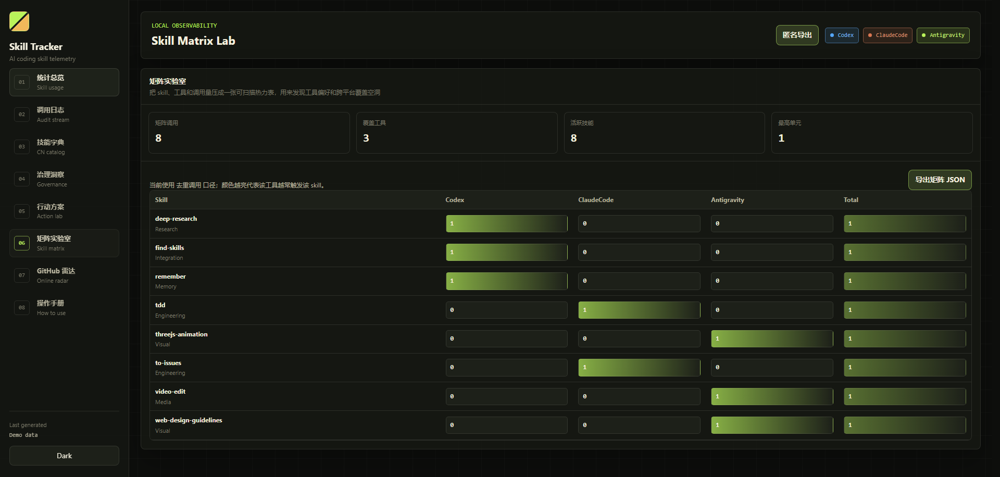

# Skill Tracker

[](LICENSE)
[](#privacy-first)
[](#quick-start)
[](#why-skill-tracker)

Local-first observability for AI agent skills.

Skill Tracker scans local AI coding-agent session logs, detects `SKILL.md` usage, and turns skill calls into a private dashboard: heatmaps, timelines, Chinese skill descriptions, duplicate-skill governance, GitHub discovery, and exportable action plans.



## Why Skill Tracker

Modern AI coding agents can call skills, plugins, prompts, and local workflows, but most users cannot see what was actually used, which skills overlap, or which descriptions are missing.

Skill Tracker makes that hidden layer visible.

- See which skills are used across Codex, Claude Code, Cursor, Windsurf, Antigravity, opencode, Aider, Cline/Roo/Kilo, Copilot, Continue, Gemini CLI, Hermes, Trae, and other local AI coding tools.
- Translate each skill's purpose into Chinese so non-English users can understand the local skill library.
- Search by natural language intent, such as "I need a skill that saves tokens".
- Detect duplicated or overlapping skills and export reviewable cleanup plans.
- Generate GitHub issue drafts from governance findings.
- Keep everything local by default. No server is required.

## 中文简介

Skill Tracker 是一个本地优先的 AI Agent 技能调用可视化工具。它扫描本机 AI 编程工具的会话日志，统计哪些 `SKILL.md` 被调用，并在静态 dashboard 中展示技能热度、调用链路、中文功能说明、重复 skill 治理、GitHub 搜索和可导出的行动方案。

它适合想管理 Codex / Claude Code / Cursor / Windsurf / Antigravity / Gemini CLI / Hermes / Trae 等工具技能体系的开发者。

## Quick Start

For normal users, download the latest `skill-tracker-*-windows-portable.zip` from Releases, unzip it, and double-click `run.bat`.

See [START_HERE.md](START_HERE.md) for the shortest onboarding path.

## Download, Mirrors, and Community Links

- GitHub repository: https://github.com/CcZzJiooo/skill-tracker
- Windows release package: https://github.com/CcZzJiooo/skill-tracker/releases
- Gitee mirror: https://gitee.com/jiojio688/skill-tracker
- GitCode / AtomGit mirror: https://gitcode.com/2301_80046217/skill-tracker
- Published articles and launch posts: [docs/PUBLISHED_LINKS.md](docs/PUBLISHED_LINKS.md)

Use GitHub Releases for the portable ZIP package. The Gitee and GitCode mirrors are useful when GitHub access is slow or when domestic users want to browse the source first.

Developers can clone the repository:

```powershell
git clone https://github.com/CcZzJiooo/skill-tracker.git
cd skill-tracker
.\run.bat
```

For the smoothest Windows launch, double-click `run.bat`. It reads local AI-agent logs first, verifies the generated local dashboard data, then opens the browser. The launcher keeps a local watcher running only after the initial scan completes.

Manual mode:

```powershell
powershell -NoProfile -ExecutionPolicy Bypass -File .\start-dashboard.ps1
```

Collector verification before release:

```powershell
powershell -ExecutionPolicy Bypass -File .\scripts\verify-collector.ps1
```

Opening `dashboard/index.html` directly uses the static `dashboard/demo_data.js` fallback so contributors can inspect the interface. Launching through `run.bat` performs a local scan first; when no supported logs exist, it produces an empty local report rather than synthetic activity.

## Project Type

Skill Tracker is a local-first observability tool, not a single agent `skill` and not a desktop `.exe`.

It has two runtime parts:

- `collect.ps1`: scans local AI-agent session logs and generates local dashboard data.
- `dashboard/index.html`: a static browser dashboard for visualization, governance, Chinese descriptions, GitHub radar, and exports.

GitHub's default "Source code" assets work for developers, but they look raw to non-technical users. For releases, maintainers should attach a Windows portable ZIP:

```powershell
powershell -ExecutionPolicy Bypass -File .\scripts\package-release.ps1 -Version v0.2.2
```

Upload both `dist/skill-tracker-v0.2.2-windows-portable.zip` and `dist/SHA256SUMS.txt` to the GitHub release. Users unzip the portable ZIP and double-click `run.bat`; it collects real local data before opening the dashboard. The release does not include a VBS launcher or create desktop shortcuts automatically.

An `.exe` wrapper is optional later, mainly for one-click onboarding. It is not required for the current architecture because there is no server, installer, or background service.

## Core Features

| Area | What it does |
|---|---|
| Skill call visualization | Shows total calls, deduplicated calls, active skills, top skills, recent sessions, and per-tool usage. |
| Date-scoped analytics | Shows the earliest and latest valid calls, then filters overview metrics, rankings, skill details, and audit rows by an optional inclusive date range. |
| Chinese skill dictionary | Maintains Chinese descriptions for every skill and supports filtering by category, missing description, and edited state. |
| Intent search | Matches Chinese or English user intent against local skills, descriptions, triggers, and categories. |
| Governance radar | Scores skill health, finds missing metadata, duplicate reads, similar skills, and conflict risks. |
| Action lab | Turns governance findings into P0/P1/P2 tasks with evidence and acceptance criteria. |
| Duplicate cleanup export | Exports a JSON cleanup plan and a PowerShell archive script. The script previews by default and only moves files when explicitly applied. |
| Skill x tool matrix | Shows cross-platform skill coverage and tool preference patterns. |
| GitHub radar | Searches public GitHub repositories, checks repository freshness, latest release, and API rate limit state. |
| Anonymous export | Exports privacy-safe reports without real session IDs, local paths, raw skill names, or full descriptions. |
| Built-in manual | Explains every dashboard section inside the app, because many GitHub users do not read README files first. |

### Automatic local skill summaries

The collector reads each installed `SKILL.md` frontmatter (`description`, optional Chinese description, and `triggers`) plus a bounded excerpt of the document body. New skills are summarized locally into `zh_desc` during every scan; no skill content is uploaded to a translation service. Watch mode also detects newly created or modified `SKILL.md` files without requiring a restart.

Each catalog entry records `zh_desc_source` (`manual`, `frontmatter`, or `auto_rule`), a source hash, and the local summary version. Existing entries without a source marker are treated as manual text, so historical edits remain safe. Editing a summary in the dashboard marks it as manual when the catalog JSON is exported.

### Dashboard date range and tool summary

The overview uses valid timestamps from the collected skill-call rows. With no date filter, the dashboard shows the actual earliest and latest matching calls in the current local report; it does not invent a reporting start date. Selecting a start or end date applies that inclusive range to overview metrics, the ranking, skill details, and the audit stream without changing local telemetry.

The top bar shows the first four detected tools and a compact expandable count for the rest, so a machine with many installed agent tools remains readable at desktop and mobile widths.

## Supported Sources

Skill Tracker currently detects common local paths for:

| Tool | Example log path |
|---|---|
| Antigravity IDE | `~/.gemini/antigravity-ide/brain/` |
| Aider | `.aider.chat.history.md`, `.aider.llm.history` in the current project or configured project path |
| Amazon Q Developer | `%APPDATA%/Code/User/globalStorage/amazonwebservices.amazon-q-vscode/` |
| Amp | `~/.config/amp/`, `%APPDATA%/amp/` |
| Augment Code | `%APPDATA%/Code/User/globalStorage/augment.vscode-augment/` |
| Claude Code | `~/.claude/projects/` |
| Cline | `%APPDATA%/Code/User/globalStorage/saoudrizwan.claude-dev/` |
| Codex | `~/.codex/sessions/`, `~/.codex/archived_sessions/` |
| Cursor | `%APPDATA%/Cursor/logs/` |
| Continue | `~/.continue/sessions/` |
| Gemini CLI | `~/.gemini/sessions/` |
| GitHub Copilot | `%APPDATA%/Code/User/globalStorage/github.copilot-chat/`, `%APPDATA%/Code/User/workspaceStorage/` |
| Goose | `~/.config/goose/sessions/`, `~/.local/share/goose/sessions/` |
| Hermes | `~/.hermes/sessions/`, `~/.hermes/logs/` |
| JetBrains AI / Junie | `%LOCALAPPDATA%/JetBrains/`, `%APPDATA%/JetBrains/`, `~/.junie/logs/` |
| Kilo Code | `%APPDATA%/Code/User/globalStorage/kilocode.kilo-code/`, `~/.kilo/` |
| opencode | `~/.local/share/opencode/log/`, `~/.config/opencode/` |
| Qwen Code | `~/.qwen/logs/openai/`, `~/.qwen/debug/`, `~/.qwen/` |
| Roo Code | `%APPDATA%/Code/User/globalStorage/rooveterinaryinc.roo-cline/` |
| Sourcegraph Cody | `%APPDATA%/Code/User/globalStorage/sourcegraph.cody-ai/` |
| Tabby | `%APPDATA%/Code/User/globalStorage/TabbyML.vscode-tabby/` |
| Tabnine | `%APPDATA%/Code/User/globalStorage/TabNine.tabnine-vscode/`, `~/.tabnine/` |
| Trae | `%APPDATA%/Trae/logs/`, `%APPDATA%/Trae/User/workspaceStorage/` |
| Windsurf | `%APPDATA%/Windsurf/logs/` |
| Zed Assistant | `%LOCALAPPDATA%/Zed/logs/`, `~/.config/zed/conversations/` |

Skill roots are auto-detected from common local skill folders. You can also set your own path in `config.json`.

After collection, Skill Tracker writes a local tool coverage report:

- `dashboard/tool_report.json`
- `dashboard/tool_report.js`

This report shows every built-in or custom source path, whether it exists on the user's machine, how many log files were scanned, and how many raw/deduplicated skill hits were found. It is the source of truth for checking whether a downloaded copy can read that user's local tools correctly.

Unknown tools cannot be guaranteed automatically unless their log path and log format expose skill calls. Add those paths through `custom_tools`, then run the collector verification command below.

## Configuration

Edit `config.json`:

```json
{
  "skills_root": "",
  "skills_roots": [],
  "output_dir": "./dashboard",
  "max_log_entries": 5000,
  "dedup_window_minutes": 2,
  "custom_tools": [
    { "name": "MyTool", "path": "C:/Users/YOU/.mytool/sessions" }
  ]
}
```

Fields:

- `skills_root`: One local skill directory. Leave empty to auto-detect common folders.
- `skills_roots`: Optional extra skill directories. Hermes skills such as `~/.hermes/skills` are auto-detected when present.
- `output_dir`: Dashboard data output directory.
- `max_log_entries`: Maximum log entries emitted for the dashboard.
- `dedup_window_minutes`: Time bucket used to collapse repeated reads.
- `custom_tools`: Extra tool names and session-log directories.

## Generated Files

Running `collect.ps1` generates or updates:

- `dashboard/skill_data.js`
- `dashboard/skill_log.js`
- `dashboard/skill_call_stats.json`
- `dashboard/skill_catalog.json`
- `dashboard/skill_catalog.js`
- `dashboard/tool_report.json`
- `dashboard/tool_report.js`

These real local telemetry files are ignored by Git on purpose. They may contain private session IDs, local paths, and internal skill metadata. The public demo data is `dashboard/demo_data.js`.

## Privacy First

Skill Tracker is designed as a local-first tool.

- It reads local logs and writes local dashboard files.
- It does not upload local skill telemetry.
- GitHub search is optional and only runs from the dashboard when you use GitHub radar.
- Anonymous export removes real session IDs, local paths, raw skill names, and full skill descriptions.

Before sharing screenshots, prefer demo data or the anonymous export.

## How It Works

AI agents usually load a skill by reading a path like:

```text
skills/<name>/SKILL.md
```

Skill Tracker scans local session logs for high-confidence skill signals: explicit `/skill` invocations, Claude Code `attributionSkill` records, and real tool reads of `SKILL.md`. Generated skill inventories, grep/search output, command output, and duplicate transcript copies are filtered out before data is emitted.

Default deduplication key:

```text
tool + session/file + skill + time bucket
```

For example, with `dedup_window_minutes = 2`, repeated reads of the same skill in the same session within two minutes count as one deduplicated call while the raw read count is preserved.

## Verification

After running collection, validate local tool detection and skill-call data:

```powershell
powershell -ExecutionPolicy Bypass -File .\scripts\verify-collector.ps1 -SkipCollect
```

The verifier checks:

- no duplicate detected tools;
- every emitted log row has a known tool and skill;
- deduplicated rows have unique dedup keys;
- visible raw log rows are not duplicated;
- `tool_report.js` exists and every detected tool has a source coverage row;
- report `raw_hits` is at least the number of emitted log rows.

## Open Source Positioning

This project is not another generic dashboard. It focuses on a new layer of AI-agent tooling: skill observability and skill governance.

Potential use cases:

- Audit which skills an agent actually uses.
- Translate and maintain a shared skill dictionary.
- Find duplicate or overlapping skills before they become prompt debt.
- Compare skill coverage across tools.
- Prepare clean GitHub issues from governance findings.
- Publish privacy-safe skill-usage reports.

## Repository Layout

```text
skill-tracker/
|-- collect.ps1
|-- config.json
|-- run.bat
|-- dashboard/
|   |-- index.html
|   |-- demo_data.js
|   |-- skill_catalog.json      # generated, ignored
|   |-- skill_catalog.js        # generated, ignored
|   |-- skill_data.js           # generated, ignored
|   |-- skill_log.js            # generated, ignored
|   `-- skill_call_stats.json   # generated, ignored
|-- docs/
|   |-- LAUNCH_KIT.md
|   |-- ROADMAP.md
|   |-- preview-desktop.png
|   `-- preview-mobile.png
|-- .github/
|   |-- ISSUE_TEMPLATE/
|   `-- PULL_REQUEST_TEMPLATE.md
|-- NOTICE
|-- CITATION.cff
|-- CONTRIBUTING.md
|-- SECURITY.md
|-- CODE_OF_CONDUCT.md
|-- SUPPORT.md
|-- LICENSE
`-- README.md
```

## Roadmap

See [docs/ROADMAP.md](docs/ROADMAP.md).

Near-term priorities:

- Better cross-platform path detection.
- More skill-source adapters.
- Import validation for `skill_catalog.json`.
- A small CLI wrapper, such as `skill-tracker collect` and `skill-tracker open`.
- Optional GitHub token support for higher API limits.

## Spread the Project

If Skill Tracker helps you understand your AI-agent skill stack, the most useful support is:

- Star the repository.
- Share a screenshot with demo or anonymized data.
- Open an issue for a new tool adapter.
- Submit a pull request for better skill-category rules.
- Mention the project when discussing AI-agent observability.

Ready-to-post launch copy is in [docs/LAUNCH_KIT.md](docs/LAUNCH_KIT.md).

## Attribution

If you use this project in another repository, article, video, product, or dataset, please keep the license notice and link back to:

```text
https://github.com/CcZzJiooo/skill-tracker
```

Citation metadata is available in [CITATION.cff](CITATION.cff). Additional attribution notes are in [NOTICE](NOTICE).

## License

MIT. See [LICENSE](LICENSE).
